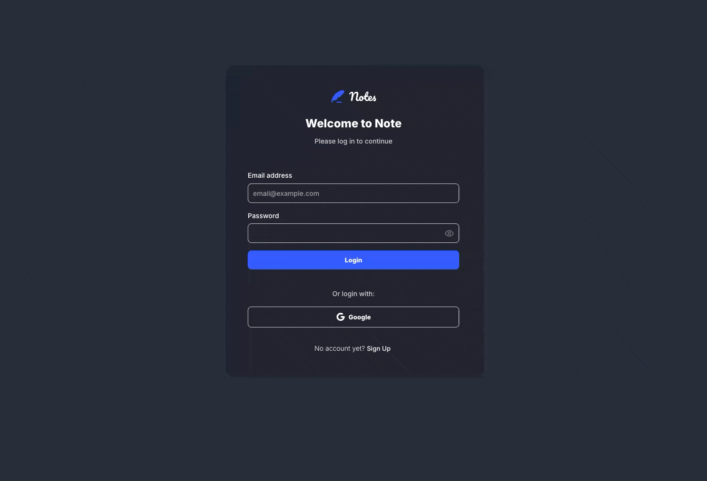
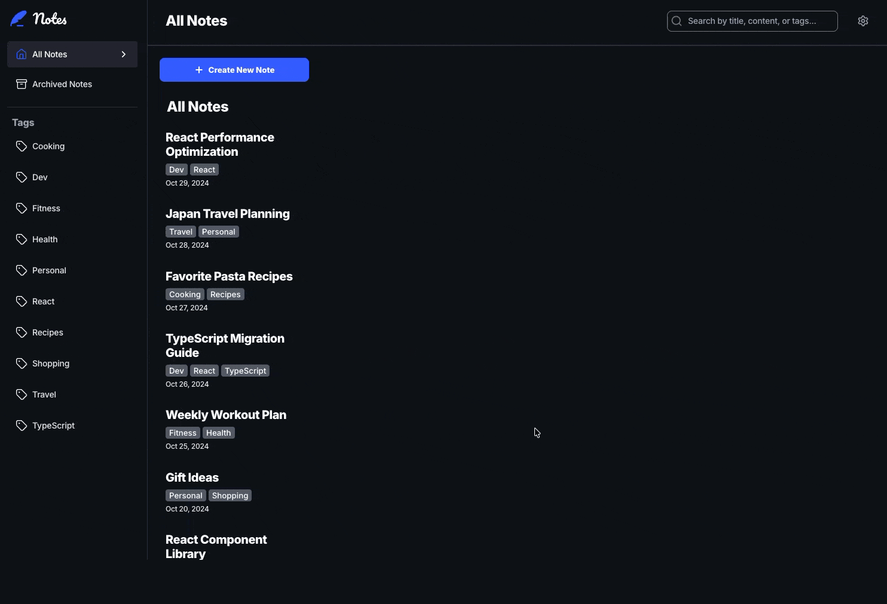
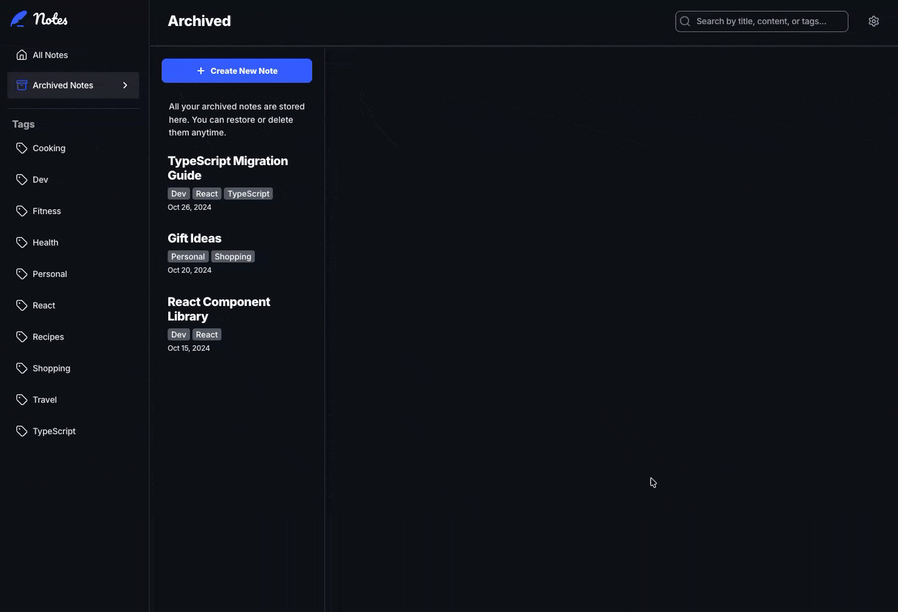

# 📝 Note Taking App

Uma aplicação de notas moderna, acessível e rica em funcionalidades, construída com React, TypeScript e Styled Components. Este projeto foi desenvolvido com foco em acessibilidade, performance e uma experiência de usuário premium.

## 🎬 Demonstração


## 📋 Sobre o Projeto

O Note Taking App é uma solução completa para organizar seus pensamentos, tarefas e ideias. Com uma interface intuitiva e responsiva, ele permite que você gerencie suas notas de forma eficiente, seja no desktop ou em dispositivos móveis. O projeto se destaca pelo seu compromisso com a acessibilidade, sendo totalmente navegável apenas por teclado, e pelo suporte a temas claro e escuro.

## ✨ Principais Funcionalidades

- **Autenticação Completa**: Telas de Login, Cadastro e Redefinição de Senha.
- **Temas Personalizados**: Suporte nativo a **Dark Mode** e **Light Mode**.
- **Acessibilidade Total**: Navegação 100% funcional via teclado e suporte a leitores de tela.
- **Gerenciamento de Notas**: Crie, edite, delete e arquive suas notas facilmente.
- **Busca**: Encontre suas notas rapidamente através da barra de pesquisa.
- **Organização por Tags**: Classifique suas notas com tags para melhor organização.
- **Design Responsivo**: Interface adaptável para qualquer tamanho de tela.

## 🛠️ Tecnologias Utilizadas

- **React**
- **TypeScript**
- **Styled Components**
- **Zustand**
- **React Router DOM**
- **Vite**
- **Lucide React** (Ícones)

## 🚀 Como Rodar o Projeto

### Pré-requisitos

Certifique-se de ter instalado em sua máquina:

- [Node.js](https://nodejs.org/) (versão 18 ou superior recomendada)
- [npm](https://www.npmjs.com/) ou [yarn](https://yarnpkg.com/)

### Instalação

1. Clone o repositório:

```bash
git clone https://github.com/orafael93/note-taking.git
```

2. Navegue até o diretório do projeto:

```bash
cd note-taking
```

3. Instale as dependências:

```bash
npm install
```

### Executando em Modo de Desenvolvimento

Para iniciar o servidor de desenvolvimento:

```bash
npm run dev
```

A aplicação será aberta automaticamente no seu navegador padrão (geralmente em `http://localhost:5173`).

### Scripts Disponíveis

- `npm run dev` - Inicia o servidor de desenvolvimento
- `npm run build` - Cria a build de produção
- `npm run preview` - Visualiza a build de produção localmente
- `npm run lint` - Executa o linter para verificar problemas no código

## 🎨 Funcionalidades em Detalhe

### Autenticação

Crie sua conta, faça login e recupere sua senha. O fluxo de autenticação é fluido e intuitivo.



### Temas Dark e Light

Alterne entre os temas claro e escuro para maior conforto visual, independentemente da hora do dia.


### Gerenciamento de Notas

Crie novas notas, edite o conteúdo, arquive as que não precisa agora ou delete as desnecessárias. Tudo com poucos cliques.



### Busca e Organização

Utilize a barra de pesquisa para filtrar suas notas instantaneamente e use tags para categorizar seu conteúdo.



### Acessibilidade (Navegação por Teclado)

A aplicação foi construída pensando em todos. Navegue por todos os elementos interativos utilizando apenas o teclado.


### Performance e Otimização (Debounce)

A busca de notas foi otimizada com a técnica de **Debounce**. Isso significa que a aplicação aguarda o usuário parar de digitar antes de processar a filtragem, evitando renderizações desnecessárias e garantindo uma experiência extremamente fluida e responsiva.

### Layout Mobile

A interface foi totalmente adaptada para dispositivos móveis. O design responsivo ajusta automaticamente o layout para oferecer a melhor experiência em qualquer tamanho de tela.


## 👨‍💻 Autor

**Rafael Pereira**

- Email: orafaeldev@gmail.com
- GitHub: [@orafael93](https://github.com/orafael93)

## 📄 Licença

Este projeto é privado e foi desenvolvido para fins educacionais e de portfólio.
