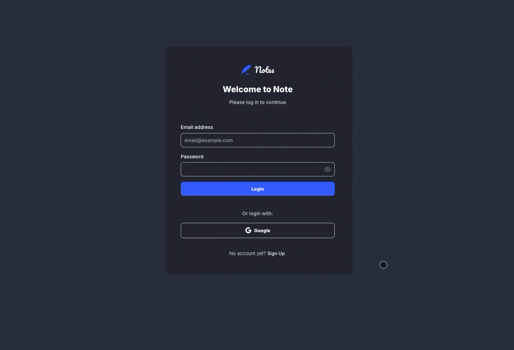
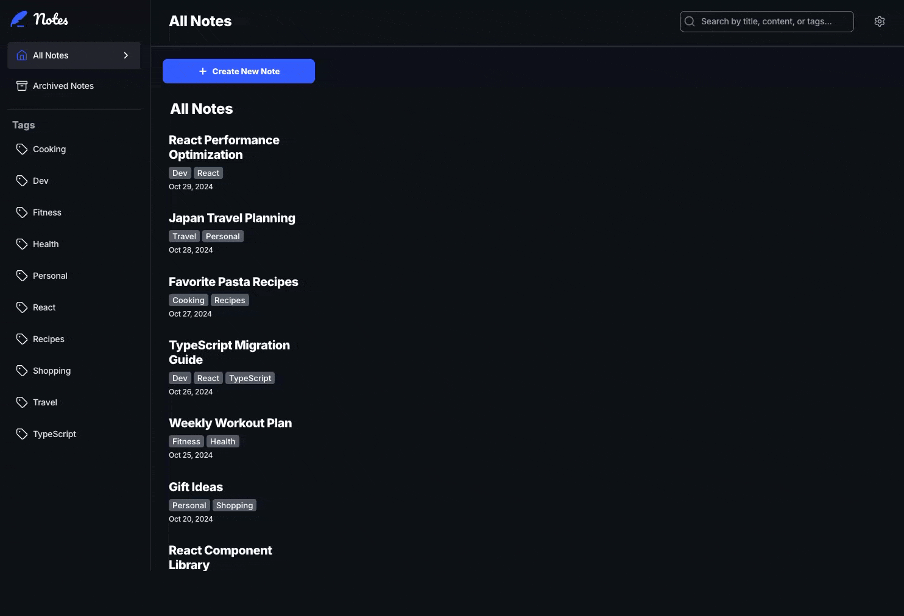
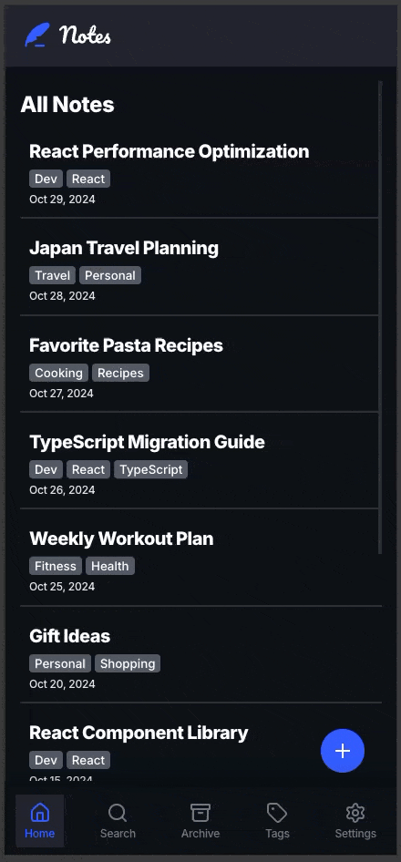

# 📝 Note Taking App

A modern, accessible, and feature-rich note-taking application built with React, TypeScript, and Styled Components. This project demonstrates a focus on scalable architecture, performance optimization, and inclusive design.

## 🎬 Demo



## 🔗 Live Preview

Check out the live version of the application here: [https://orafael.dev/note-taking-app/](https://orafael.dev/note-taking-app/)

## 🏗️ Architectural Highlights

As a Front-end Engineer, I made specific architectural decisions to ensure the application is robust, maintainable, and user-friendly:

### 1. Scalable State Management with Zustand

I chose **Zustand** over other state management libraries (like Redux or Context API) for its lightweight footprint and simplicity. It allows for a scalable global state without the boilerplate code, ensuring the application remains performant even as complexity grows.

### 2. Commitment to Accessibility (WCAG)

Accessibility is not an afterthought; it is a core feature. I followed **WCAG (Web Content Accessibility Guidelines)** to ensure the application is inclusive.

- **100% Keyboard Navigation**: Every interactive element is accessible via keyboard.
- **Screen Reader Support**: Proper ARIA labels and semantic HTML are used throughout.

### 3. Performance Optimization

To ensure a smooth user experience, I implemented **Debounce** logic for the search feature. This prevents unnecessary re-renders and calculations by waiting for the user to stop typing before processing the search query, significantly improving performance on lower-end devices.

## ✨ Key Features

- **Complete Authentication**: Login, Sign Up, and Password Reset flows.
- **Custom Themes**: Native support for **Dark Mode** and **Light Mode**.
- **Note Management**: Create, edit, delete, and archive notes effortlessly.
- **Smart Search**: Instantly find notes using the optimized search bar.
- **Tag Organization**: Categorize notes with tags for better structure.
- **Responsive Design**: A seamless experience across desktop and mobile devices.

## 🛠️ Tech Stack

- **React**
- **TypeScript**
- **Styled Components**
- **Zustand**
- **React Router DOM**
- **Vite**
- **Lucide React** (Icons)

## 🚀 Getting Started

### Prerequisites

Ensure you have the following installed:

- [Node.js](https://nodejs.org/) (version 18 or higher)
- [npm](https://www.npmjs.com/) or [yarn](https://yarnpkg.com/)

### Installation

1.  Clone the repository:

    ```bash
    git clone https://github.com/orafael93/note-taking.git
    ```

2.  Navigate to the project directory:

    ```bash
    cd note-taking
    ```

3.  Install dependencies:
    ```bash
    npm install
    ```

### Running Locally

Start the development server:

```bash
npm run dev
```

The app will open automatically in your browser (usually at `http://localhost:5173/note-taking-app`).

## 🎨 Feature Showcase

### Authentication

Secure and intuitive flows for account creation, login, and password recovery.


### Dark & Light Themes

Switch between themes to match your preference and reduce eye strain.



### Note Management

Easily manage your thoughts. Create, edit, archive, or delete notes with a few clicks.


### Search & Organization

Filter notes instantly using the optimized search and organize them with tags.


### Accessibility (Keyboard Navigation)

Fully navigable using only the keyboard, ensuring a barrier-free experience for all users.


### Mobile Layout

A fully responsive design that adapts perfectly to mobile screens.



## 👨‍💻 Author

**Rafael Pereira**

- Email: orafaeldev@gmail.com
- GitHub: [@orafael93](https://github.com/orafael93)
